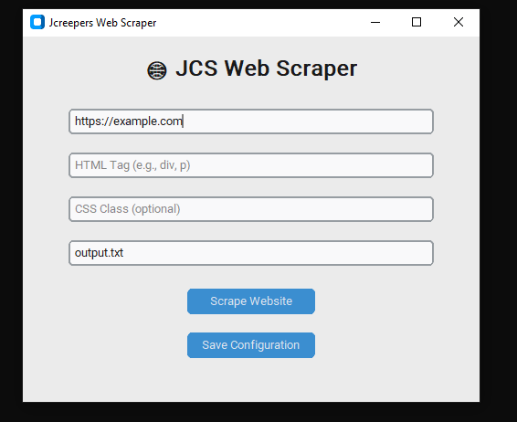

🌐 Web Scraper Pro – Configurable Python GUI Scraper
A modern, easy-to-use Python web scraper with a professional GUI for scraping content from websites. Built with BeautifulSoup and CustomTkinter, this tool lets you fetch website data, customize settings, and save output with just a few clicks.

✨ Features
✅ Beautiful GUI – Built with CustomTkinter for a clean and modern interface.
✅ Configurable Settings – Supports saving and loading settings from a config.json file.
✅ Formatted Output – Saves scraped data into a text file or easily extendable to HTML.
✅ Fast & Lightweight – Simple, beginner-friendly, and easy to extend.
✅ Error Handling – Alerts for connection issues or empty results.

💻 Screenshots


📥 Installation
```bash
git clone https://github.com/yourusername/web-scraper-pro.git
cd web-scraper-pro
```
Install the dependencies:
```bash
pip install requests beautifulsoup4 customtkinter
```
Run the app:
```bash
python scraper_gui.py
```

🖥️ How to Use
Launch the app by running scraper_gui.py.

In the App
Enter the website URL to scrape.
Specify the HTML tag (e.g., div, p) you want to extract.
(Optional) Add a CSS class for more targeted scraping.
Set the output file name (e.g., output.txt).
Click "Scrape Website" to start scraping.
Results will be saved in the specified file.
(Optional) Click "Save Configuration" to store your settings in config.json for later use.

🛠 Example
Setting	Example
URL	https://example.com
HTML Tag	p
CSS Class (optional)	article-content
Output File	results.txt

📄 Config File (config.json)
You can edit your scraper settings directly in config.json:

```Bash
{
  "url": "https://example.com",
  "search_tag": "p",
  "search_class": "article",
  "output_file": "output.txt"
}
```

